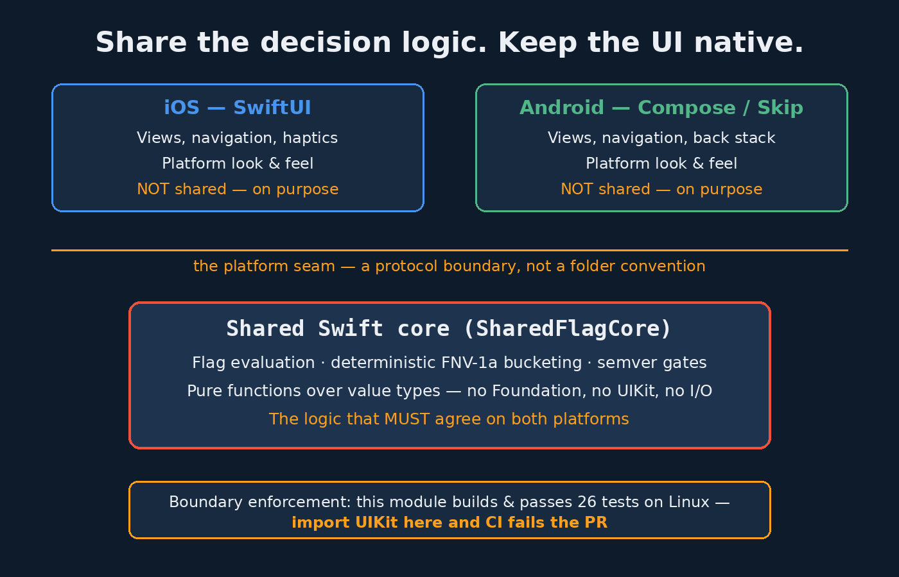

# swift-cross-platform-core-article-demo — SharedFlagCore

Companion demo for the article **"Swift Now Runs on Android. Here's What I'd Actually Share — and What I Wouldn't."**
(Article: added after publish — see below.)

Skip is free and open source, Swift 6.3+ ships an official Android SDK, and the Swift on
Android Community Workgroup exists. This repo is the opinionated answer to "so what do we
share?": **the decision logic, never the UI** — demonstrated with the one piece of logic
that most painfully diverges between an iOS and an Android codebase today: **feature-flag
rollout evaluation**.

## What's inside

```
Sources/SharedFlagCore/     the shared core — pure Swift, ZERO imports (not even Foundation)
  SemanticVersion.swift       strict semver parsing; malformed input returns nil, never guesses
  DeterministicBucketer.swift FNV-1a 64-bit bucketing — identical on iOS, Android, Linux
  FlagModels.swift            flags, rules, context, and audit-friendly evaluation results
  FlagEvaluator.swift         first-match-wins rule evaluation, fail-safe version gating
Tests/SharedFlagCoreTests/  26 tests, including golden hash values verified against an
                            independent reference implementation
Demo/                       SwiftUI playground app + Demo.xcodeproj (local package reference)
article-assets/             images used by the article
```

## Why this exact logic is the cross-platform argument

Percentage rollouts only work if the same user gets the same answer everywhere. Swift's
built-in `Hasher` is **randomized per process** — so any team that "implemented the same
bucketing" twice, once in Swift and once in Kotlin, is one refactor away from a user being
in the experiment on their phone and out of it on their tablet. The shared core makes that
class of bug structurally impossible:

```swift
public static func bucket(flagKey: String, subjectID: String) -> Int {
    let hash = fnv1a("\(flagKey):\(subjectID)")   // FNV-1a: fully specified, platform-free
    return Int(hash % bucketCount)                 // 10_000 buckets = basis-point rollouts
}
```

And the evaluation result carries its own audit trail, because "why did this user get this
variant" must have the same answer on both platforms:

```swift
let result = FlagEvaluator.evaluate(flag, in: context)
// result.bucket  -> 4950
// result.reason  -> rule #0 matched; bucket outside 5000 bp rollout
```



## The boundary is enforced, not promised

`SharedFlagCore` imports nothing — not even Foundation. The proof: **this package was
built and its full test suite (26/26) run on Linux** with Swift 6.0.3, the same class of
environment as the Android toolchain. The moment someone `import UIKit`s the core, the
Linux CI leg fails the PR. That's the whole governance model, and it costs one CI job.

```
swift build   # Build complete! (1.36s)
swift test    # Executed 26 tests, with 0 failures
```

## How to run the demo app

1. Clone this repo (one repo — the demo consumes the library via a local package reference).
2. Open `Demo/Demo.xcodeproj` in Xcode.
3. Pick any iOS Simulator and **Build & Run** — no other setup.

The app is a live playground: change the subject ID, region, and app version, and watch
every flag re-evaluate with its bucket and reason — all decided by the shared core, none
of it by the app.

### Honest verification note

This repo was produced by an unattended pipeline run. `swift build` and `swift test`
(26/26) were run for real on Linux — which is itself the cross-platform point — and the
demo Swift files pass `swiftc -parse`. But the Simulator launch step could not be
performed this run: computer-use access is hard-blocked during scheduled runs
("Computer-use access can't be approved during a scheduled run"), so there are no
Simulator screenshots here, and this README deliberately does not claim a launch that
didn't happen. The `Demo.xcodeproj` follows the exact same hand-authored pattern
(local `XCLocalSwiftPackageReference`, committed bundle ID, generated Info.plist keys,
shared scheme) that has opened and run cleanly in prior repos in this series.

## License

MIT — do whatever you like with it.
